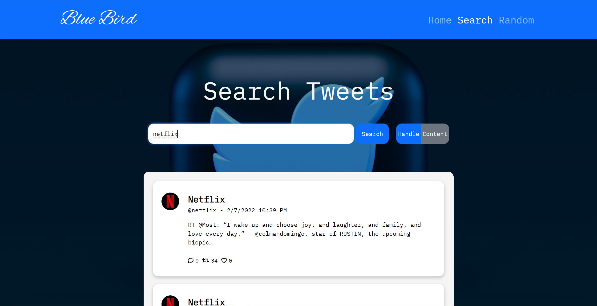
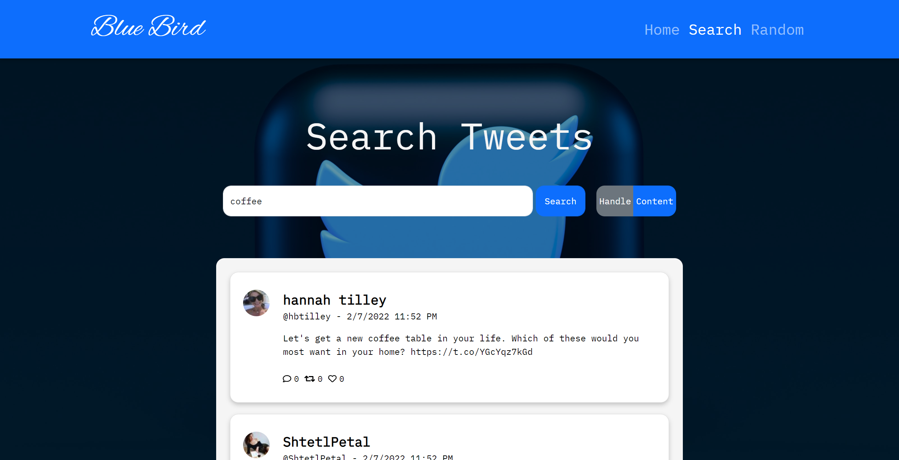
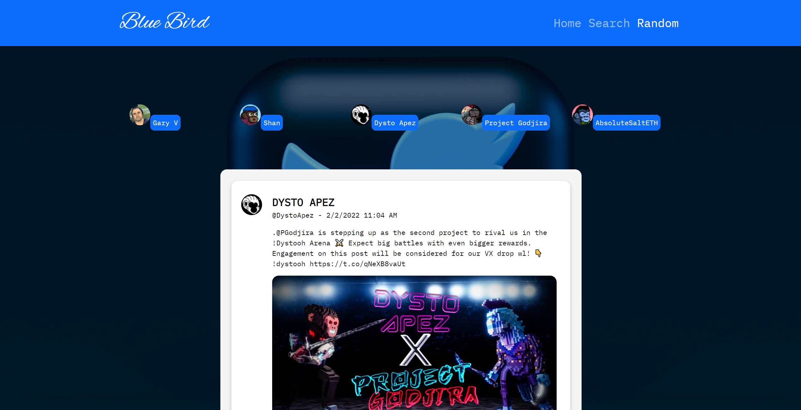

# Blue Bird Twitter API Application

# Overview

- Search tweets by Twitter handle and by content
- View random tweets from 5 popular accounts in the NFT twitterverse

# Website

- See it [here](https://bluebirdtwitterapp.azurewebsites.net/) on Azure! 

# Preview

- Search Page (by twitter handle)

- Search Page (by content)

- Random User Page

# Summary

My goal for this project was to build a full-stack application that interacts with an external API and understand the role each part in the application plays. Before touching the keyboard, I decided to isolate my learning into three sections, the internal API, the front-end, and stitching the two together, executed in that order. This application was built using React JS on the frontend and an ASP.NET Web API on the backend. Three endpoints were created in the internal API for retrieving tweets from the Twitter API and returning the data to the front end. The RestSharp library was used to make HTTP requests to the Twitter API and facilitated authentication for returning tweets. In order to handle a user's timeline of tweets returned from twitter, custom C# classes were created to represent the returned JSON data. Using deserialization, I was able to work with a UserTimeline object and generate a list of TweetObjects. These TweetObjects contained only the necessary data from the UserTimeline object and were returned to the frontend via the internal API endpoints. The MVC architecture gave me a reliable mental model for data flow throughout the entire application and showed me the power of delegating responsibilities within a complex project. My greatest challenge by far was understanding how to make these two applications talk with one another and serving the static files from the .NET server was definitely an ‘ah-ha’ moment for me. Overall, I had a ton of fun building this out from the styling to the server-side code and I’m eager to continue adding cool features while learning along the way!

- Detailed Features:
    - Authenticate with Twitter API v2 using RestSharp and basic authentication
      - Internal API created with ASP.NET Core Web API to interact with Twitter API v2 
    - Query the Twitter API v2 to return a user's usertimeline of tweets
      - Created custom UserTimeline C# object to represent JSON response from Twitter
      - Deserialize JSON response and manipulate fields to generate list of custom TweetObjects to return to frontend
    - Utilize async and await for asynchronous API calls from the frontend and to the Twitter API v2 
    - Render list of customized TweetObjects as the user's timeline using .map() technique on frontend
    - Endpoints:
      - /users/by/username/:username resource to grab a user's id
      - /users/:id/tweets to grab a user's timeline of tweets by id
      - /tweets/search/recent with the "?query" query parameter to retrieve recent tweets from a keyword search
    - TweetObject consists of:
      - User profile picture
      - Screename
      - Twitter handle
      - Text
      - Video preview images (full videos not supported on free tier plan)
      - Images
      - Public metrics (likes, comments, retweets)
    

# Running it locally
### Steps:
1. Navigate to desired directory
2. Use `git clone <repo link>` to clone repository onto your local machine
3. Navigate to the `/frontend` directory and run the command `npm install` to get all necessary dependencies
4. Get apiKey and secretKey from a Twitter Developer Portal
    - If you do not have an account, signup for free and generate your apiKey and secretKey here: `https://developer.twitter.com/`
5. Add apiKey and secretKey inside of the appsettings.json as folllows on the same level as "Logging":
    - `"Twitter" : {
                    "ApiKey" : "your key here", 
                    "SecretKey" : "your key here"
                  }`
6. Navigate to the `/Twitter-Showcase-WebAPI` directory and run the command `dotnet run bulid`
7. Open a browser and go to https://localhost:5001 for https or http://localhost:5000 for http 

# Author

Brandon Chuck | Full Stack Developer | [LinkedIn](https://www.linkedin.com/in/brandonchuck/) | [Personal Website](https://www.brandonchuck-dev.com)
